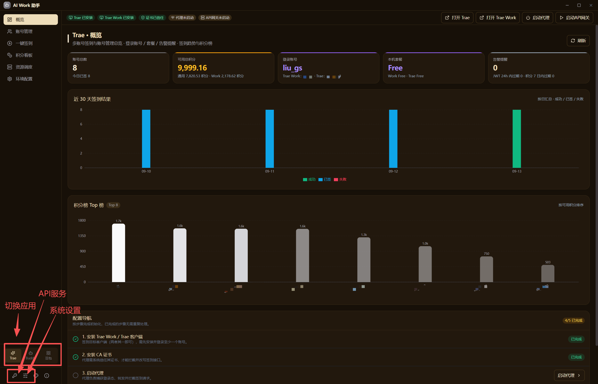

<div align="center">


# AI Work 助手（AI Work Assistant）

Windows 桌面端多账号签到与管理一站式工作台 · Tauri 2 + React 18 + Rust

</div>



> 深度支持 **Trae Work / Trae（Trae CN IDE）/ WorkBuddy / CodeBuddy / 豆包** 五应用：多账号签到、登录态切换、积分看板、成长中心自动化、OpenAI / Anthropic / Codex 三协议兼容 API 网关（Trae + WorkBuddy + 自定义模型三池调度）、6 层设备标识重置等；Trae 双应用同一账号体系可分别切换，WorkBuddy 与 CodeBuddy 共享账号体系，豆包支持快照切换 / 保活 / 额度巡检 / 对话备份。后续规划扩展更多 AI 应用。
>
> ⚠️ 本工具与 Trae Work / WorkBuddy / 豆包等官方均无任何关联，仅供学习研究。使用本工具可能违反相关服务条款，风险自担。请仅管理本人合法持有的账号。

## 版本与分支

- **v3.x 新版本线（默认分支）**：产品为「AI Work 助手」，支持 Trae Work / Trae（Trae CN）/ WorkBuddy / CodeBuddy / 豆包多应用；新版本自 **3.0.0** 起开始维护。
- **原「Trae Work 助手」产品**：通过 **`trae_work_main`** 分支维护，仅支持 Trae Work 单应用，版本停留在 **2.x.x**，仅做必要修复、不再新增功能。
- **升级与数据迁移**：新版本从 3.0.0 开始，**之前所有版本（2.x 全系）升级到 3.x 都需要迁移数据**——数据目录、界面偏好、签到计划任务会在安装 / 首次启动时**自动完成迁移**，无需手动操作（详见下方「从老版本升级」）。

## 免责声明

> 本工具仅供学习研究和个人使用，使用者需自行承担一切风险与后果。

1. **非官方申明**：本工具与 Trae / TRAE Work 等相关产品官方**无任何隶属、合作或关联关系**，不代表官方立场。
2. **使用风险**：使用本工具可能违反 Trae Work 的服务条款；由此产生的任何后果（包括但不限于账号封禁、积分清零/扣除、功能限制、数据异常等）均由使用者自行承担。
3. **责任范围**：本工具不对因使用（或无法使用）本工具所导致的任何直接、间接、附带或后果性损失负责。
4. **合规义务**：使用前请务必仔细阅读 Trae Work 的服务条款，并自行判断是否使用；请确保仅用于管理本人合法持有的账号，遵守所在地法律法规。
5. **责任说明**：本工具维护方对任何因使用、误用或滥用本工具而引发的纠纷、争议或问题不承担任何责任。
6. **侵权处理**：若您认为本工具侵犯了您的合法权益，请通过项目渠道反馈，我们将在核实后及时处理。

**使用本工具即表示你已阅读、理解并同意上述全部免责声明。**

## 功能

- **账号管理**：多账号录入/编辑/OAuth 登录（含 WorkBuddy 扫码与 **BitBrowser 原生 OAuth 接管**）、分组管理、设备 ID 隔离、**本机双应用（Trae Work / Trae）账号自动发现**、WorkBuddy/CodeBuddy auth 文件扫描入池、豆包抓包凭证回写
- **登录态切换**：按目标应用独立切换——保存当前登录态 → 恢复目标账号 → 启动；Trae 系精准备份 9 类核心文件，豆包 chromium 布局含快照版本校验 + 单代回滚 + 防误覆盖守卫，WorkBuddy/CodeBuddy authfile 布局；支持「一键以账号打开」
- **一键签到**：批量签到、按分组/手动勾选、跳过已签/过期、实时进度；WorkBuddy 成长中心自动化（旅行/盲盒/任务领奖）；豆包/WorkBuddy 定时保活与续期
- **积分看板**：排行、三线趋势图、今日新增统计；WorkBuddy 积分三件套 + 官方用量 + 本地 Token 统计（缓存命中率/热力图）+ 到期日历
- **本地代理**：MITM 代理自动捕获 JWT / 豆包凭证、注入独立设备 ID；**自动串联已有系统代理（VPN）作为上游**，停止时原样还原系统代理
- **API 网关**：内嵌 OpenAI / Anthropic / Codex Responses 三协议兼容 API 服务——Trae 账号池 + WorkBuddy 池 + 自定义 OpenAI 兼容模型三池调度（smart 智能策略/优先级/模型级覆盖）、本机会话连续性与存档、Seedance Work 积分视频任务桥（`/v1/videos/generations`）、会话粘性、ck_ 子 Key、审核指纹清洗、生图双端点、web_search 工具代执行；监听地址、LAN API Key、可选 CORS 与 SSH 反向隧道均在接口配置中显式控制
- **可复用 Skill**：仓库内 `skills/aiwork-seedance` 提供标准 `SKILL.md`、Windows 一键安装器和无 Python 依赖的 PowerShell runner；Codex/Claude Code 可按 Agent Skills 目录发现，DSH/Qoder 可调用同一 runner 或 MCP 兼容桥
- **定时任务**：Windows 计划任务，后台自动签到 / 保活 / 续期 / 额度巡检
- **6 层设备标识重置**：machineid / storage.json 遥测 / aha.device / 注册表 MachineGuid / webview 追踪数据 / aha TinyStorage
- **快照管理**：查看/备份/恢复/删除账号登录态快照（各应用独立管理）；豆包/WorkBuddy 对话数据独立备份恢复与导出
- **暗色模式**：6 套主题，图表动态适配
- **数据全部本地存储**，不上传任何服务器

## 开发

```powershell
npm install
npm run tauri dev      # 开发模式
npm run tauri build    # 打包（msi + nsis）
python scripts/rename_release.py   # 安装包统一输出到 release/，命名 AI Work 助手_<版本>_x64*
python scripts/package_portable.py # 便携版 zip（AI Work 助手_<版本>_x64_portable.zip）
```

前置：Node.js 18+、Rust 1.75+、Python 3.9+、WebView2 Runtime、VS Build Tools (C++)

## 从老版本升级

> **提示**：如果你只使用 Trae Work（不需要 TRAE SOLO / WorkBuddy 等新支持的应用），可以不升级——原「Trae Work 助手」产品线在 `trae_work_main` 分支维护（2.x.x，仅必要修复），使用 v2.x.x 最新版本即可，功能完全一致。
>
> **新版本从 3.0.0 开始**：之前所有版本（2.x 全系）升级到 3.x 都需要迁移数据，迁移在安装 / 首次启动时自动完成。

升级兼容按**安装时的产品名**判定，与版本号无关：

- **旧品牌「Trae Work 助手」（已发布的 v2.4.4 及更早）**：新版安装时会自动结束旧进程、**静默卸载**并清理残留（安装目录 / 卸载键 / 快捷方式），首次启动自动完成数据迁移，无需手动操作。
- **新品牌「AI Work 助手」（v3.0.0 起）**：产品名一致，直接双击新安装包即走**原生原地升级**，用户数据不受影响。
- **自动迁移内容**：数据目录 `%APPDATA%\TraeWorkAssistant` → `%APPDATA%\AIWorkAssistant`（**复制**迁移，旧目录原地保留，**老应用可继续使用、新旧两版可并存**；新目录已有数据则自动跳过，不会重复迁移）、界面偏好、每日签到计划任务（按原触发时间重建新任务，旧任务保留给老应用）。
- **MSI 安装包**：因产品标识变更，老版 MSI 无法原地升级，请先卸载旧版再安装（或改用 NSIS 安装包，推荐）。
- 旧版定时任务如未自动迁移，请在「设置 → 定时任务」重新注册一次。

## 数据目录

```
%APPDATA%\AIWorkAssistant\
├── conf/
│   └── app_settings.json        # 设置
├── data/
│   ├── checkin_accounts.json    # 账号 + JWT
│   ├── device_map.json          # 设备 ID 映射
│   ├── groups.json              # 分组
│   ├── credits_history.json     # 积分历史（签到明细）
│   ├── credits_daily.json       # 每日积分快照（三线趋势图数据源）
│   ├── remaining_credits.json   # 各账号剩余积分缓存
│   ├── account_cooldowns.json   # 签到错误冷却状态
│   ├── api_pool.json            # API 账号池配置
│   ├── assets.json              # 参考图/参考视频素材索引（仅元数据）
│   ├── assets/                  # 参考素材临时目录（默认保留 2 小时）
│   ├── video_tasks.json         # Seedance 任务索引
│   ├── videos/                  # Seedance 视频缓存
│   └── profiles/                # 登录态快照（按账号 ID 分目录）
│       ├── current_account.txt  # 当前活跃账号 ID
│       └── <user_id>/           # 各账号登录态备份
└── logs/                        # proxy / checkin / switcher / api / proxy-requests 日志
```

## 文档

- [更新日志](CHANGELOG.md) — 各版本变更记录
- [用户手册](docs/user-manual.md) — 功能说明与使用指南
- [产品设计](docs/product-design.md) — 需求与产品设计基线（v1.0/v2.0）
- [产品优化需求清单](docs/product-optimization-backlog.md) — 全项目唯一待办依据（需求概述/实现路径/验证依据）
- [技术架构设计](docs/tech-framework.md) — 架构/数据模型/协议参考（含 WorkBuddy、豆包协议附录与实现方向映射）/开发运维

## License

本项目采用 [MIT License](LICENSE)，版权归 AI Work Assistant 项目所有。

Fork / 二次开发请保留 `LICENSE` 及版权声明，并在变更说明中注明修改范围。
